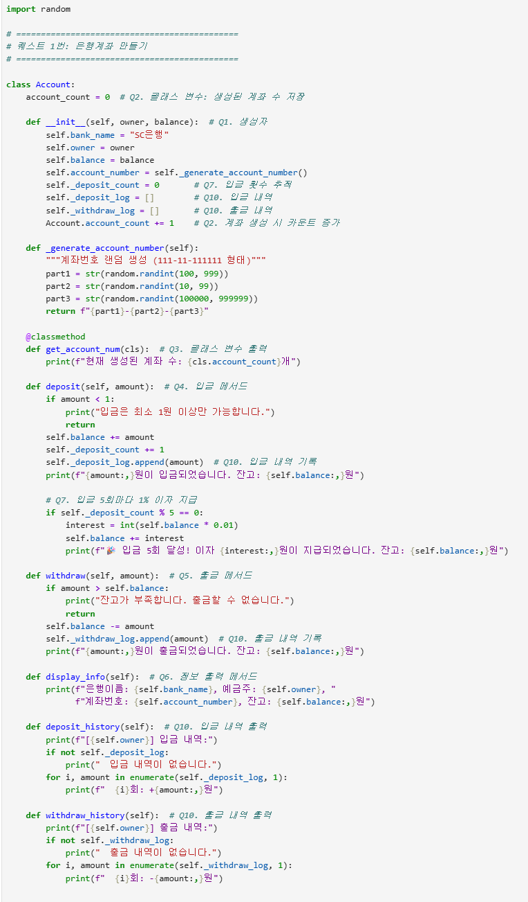
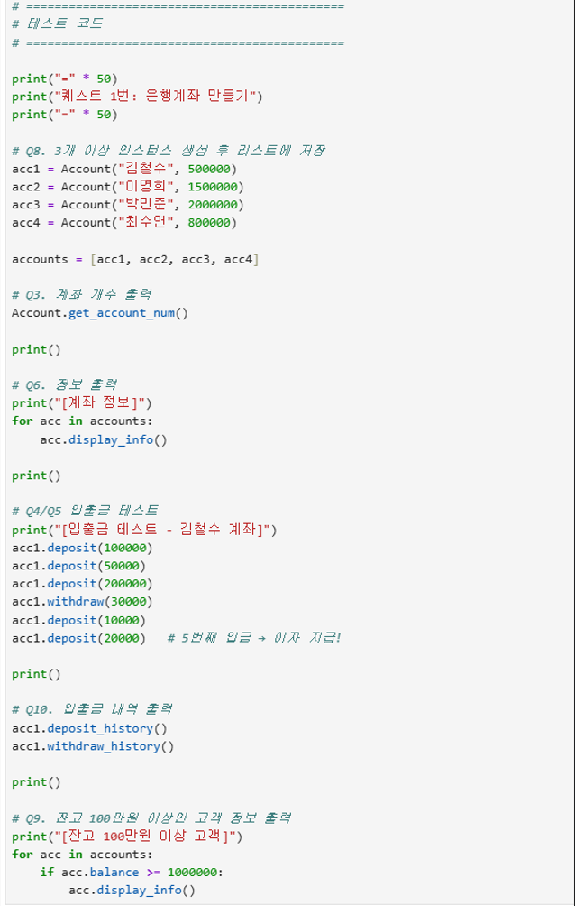
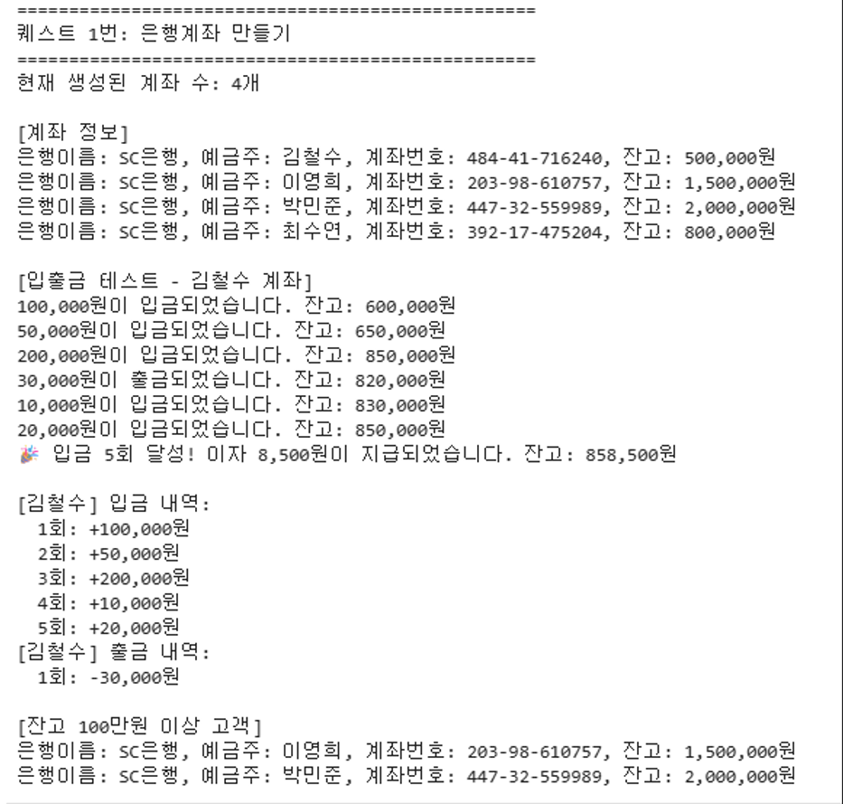
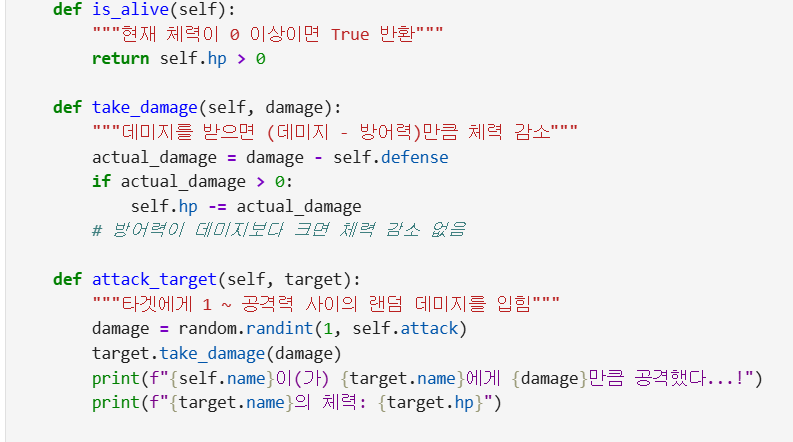
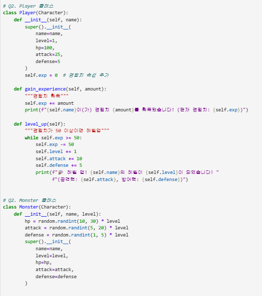
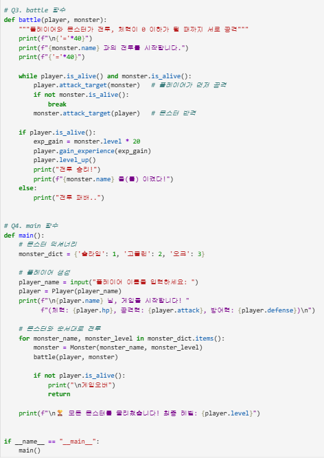

# AIFFEL Campus Online Code Peer Review Templete
- 코더 : 이예령
- 리뷰어 : 김수경


# PRT(Peer Review Template)
- [x]  **1. 주어진 문제를 해결하는 완성된 코드가 제출되었나요?**


  
Quest 순서도 같이 주석으로 쓰여 있어서 이해에 도움 되었고, 출력도 잘되고 있습니다.

  
- [x]  **2. 전체 코드에서 가장 핵심적이거나 가장 복잡하고 이해하기 어려운 부분에 작성된 
주석 또는 doc string을 보고 해당 코드가 잘 이해되었나요?**


문제에서 제시한 게임의 필요한 부분을 주석으로 붙여 놓아서 쉽게 확인할 수 있었습니다.
        
- [ ]  **3. 에러가 난 부분을 디버깅하여 문제를 해결한 기록을 남겼거나
새로운 시도 또는 추가 실험을 수행해봤나요?**

  디버깅이나 에러는 없던거같습니다.


        
- [ ]  **4. 회고를 잘 작성했나요?**

        
- [x]  **5. 코드가 간결하고 효율적인가요?**


문제에서 주어진 요구 조건을 잘 맞춰서 작성하셨습니다.


# 회고(참고 링크 및 코드 개선)
```
# 리뷰어의 회고를 작성합니다.
# 코드 리뷰 시 참고한 링크가 있다면 링크와 간략한 설명을 첨부합니다.
# 코드 리뷰를 통해 개선한 코드가 있다면 코드와 간략한 설명을 첨부합니다.
```

퀘스트를 같이 올려주신 부분이 좋았습니다.  
다음에 다시 보게 될때 이해하는데 좋을거같습니다.  
컴퓨터 변경하셔서 깃허브 잘안되셔서 당황하셨을텐데 잘되셨네요!  

